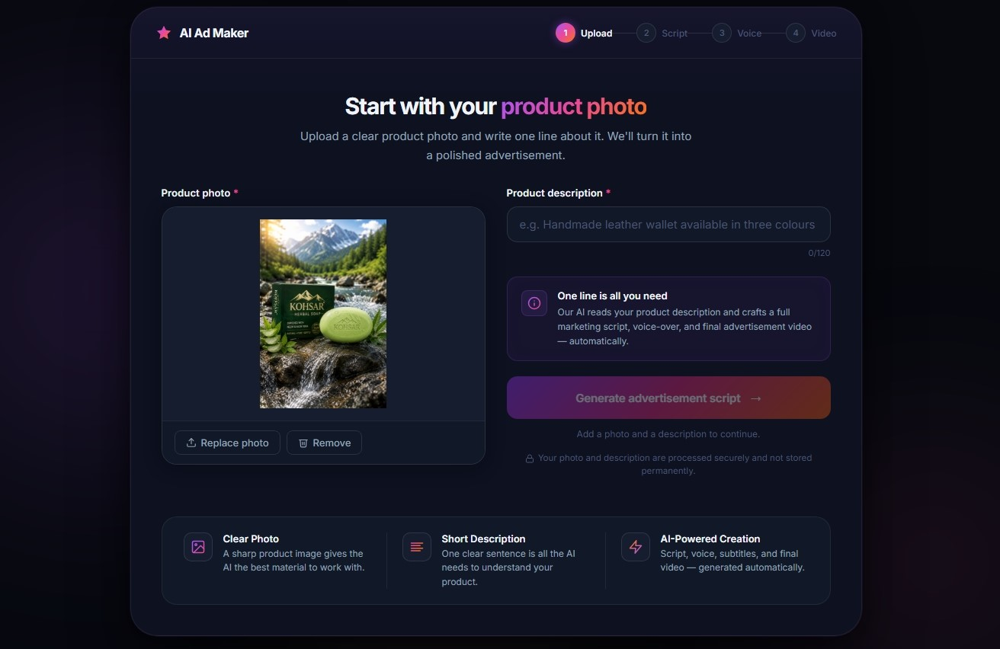
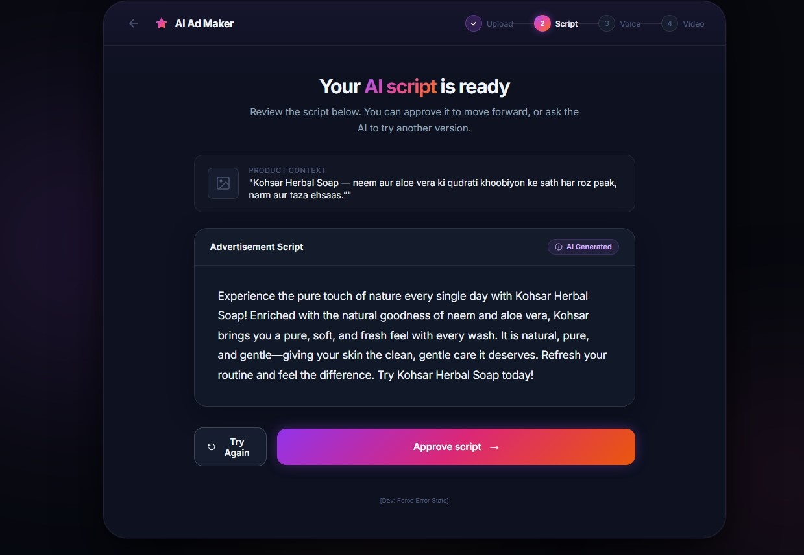
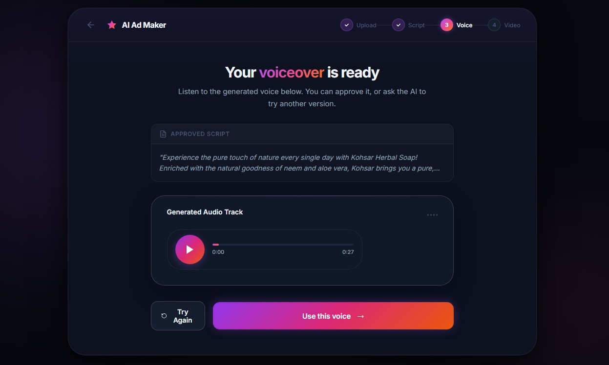
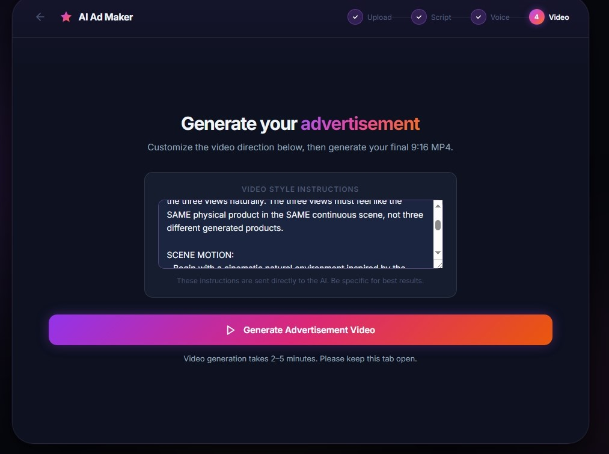
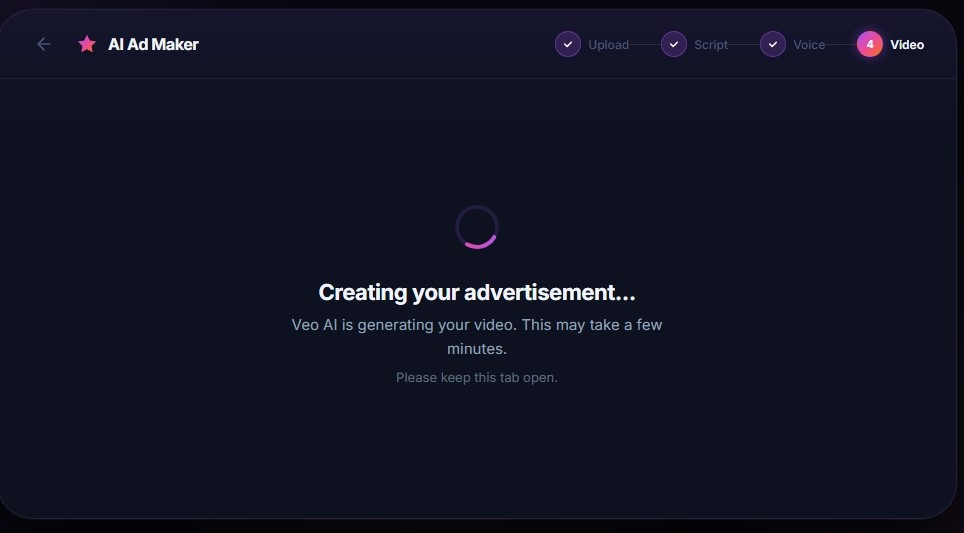
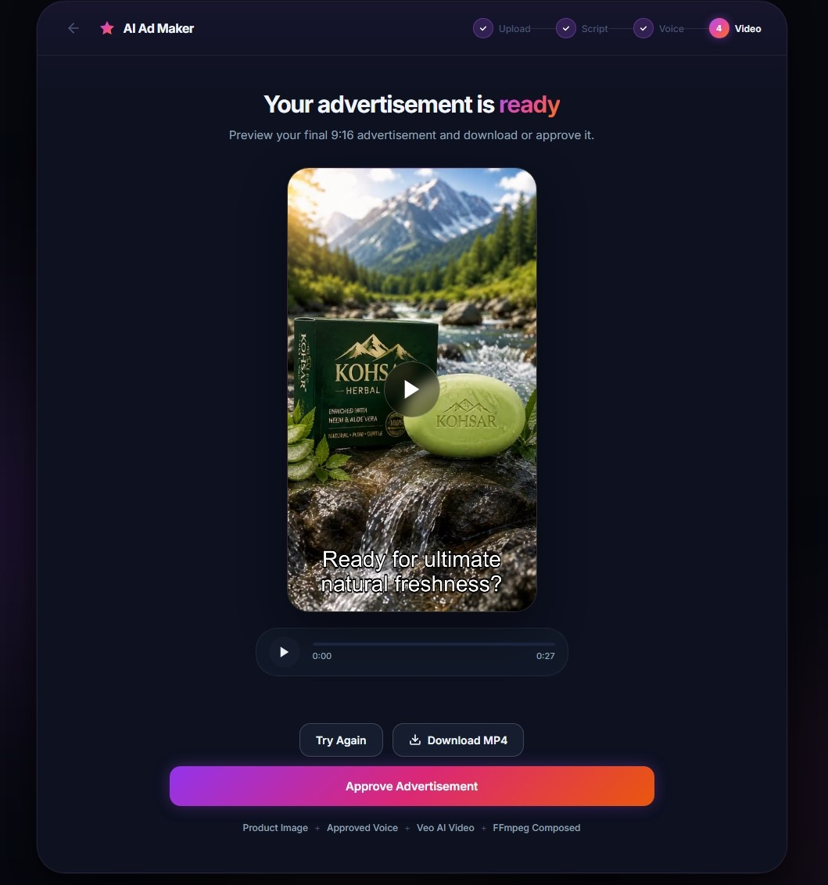
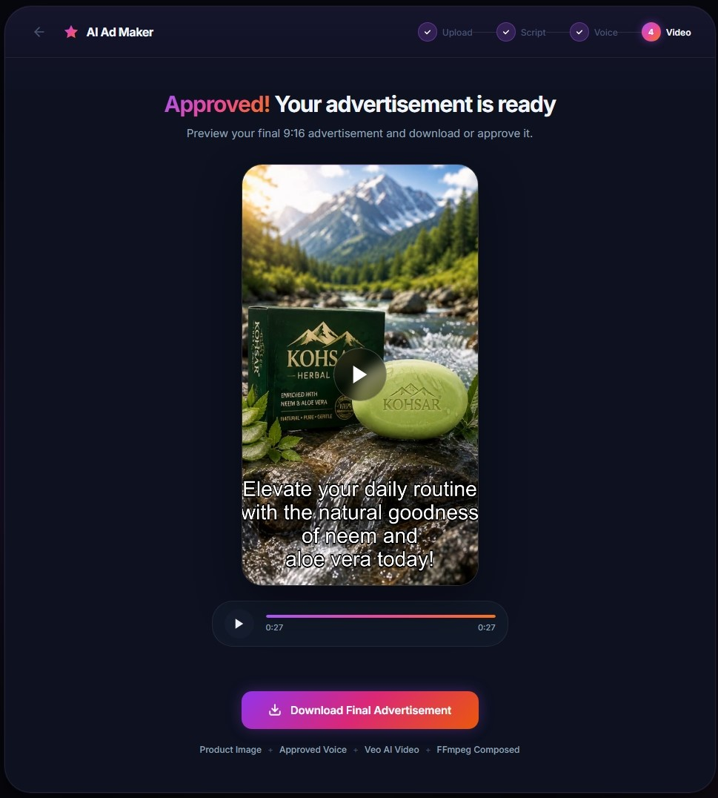

  

  
  
  
  

 

  <h3><em>Transform a single product photo into a fully synchronized, professional video advertisement using the power of Generative AI.</em></h3>

## 🌟 Vision & Architecture

**AI Ad Maker** is an autonomous, end-to-end marketing automation system. Designed for e-commerce owners and digital marketers, it eliminates the need for complex video editing software. 

### 🧠 How It Works
1. **Context Understanding**: Google Gemini 3.6 Flash analyzes the uploaded product image and description to craft a highly persuasive 30-second marketing script.
2. **Auditory Synthesis**: Advanced TTS models convert the script into a dynamic, cheerful human voiceover.
3. **Temporal Multi-Clip Generation**: The backend chunks the script into logical scenes, generating consecutive motion clips using **Wan 2.1-i2v-turbo**, while maintaining character and product consistency.
4. **Cinematic Assembly**: FFmpeg dynamically coordinates clip concatenation, audio multiplexing, and auto-burns perfectly timed subtitle translations directly into the final `.mp4`.

---

## 🛠️ Premium Technology Stack

<table align="center" width="100%">
  <tr>
    <td align="center" width="50%">
      <h3>Frontend Experience</h3>
      
      
      
        
      <em>Featuring a modern, responsive Glassmorphism UI engineered for seamless user flows.</em>
    </td>
    <td align="center" width="50%">
      <h3>Backend Intelligence</h3>
      
      
      
        
      <em>Powered by Google GenAI SDK, handling heavy asynchronous media processing pipelines.</em>
    </td>
  </tr>
</table>

---

## 🎬 Platform Walkthrough

  <em>Experience the end-to-end journey from a static image to a cinematic video ad.</em>

<table align="center" width="100%">
  <tr>
    <td align="center" width="50%">
      <h4>1. Upload & Analysis</h4>
      
    </td>
    <td align="center" width="50%">
      <h4>2. Script Generation</h4>
      
    </td>
  </tr>
  <tr>
    <td align="center">
      <h4>3. Voice Synthesis</h4>
      
    </td>
    <td align="center">
      <h4>4. Scene Planning</h4>
      
    </td>
  </tr>
  <tr>
    <td align="center">
      <h4>5. Dynamic Rendering</h4>
      
    </td>
    <td align="center">
      <h4>6. Synchronization</h4>
      
    </td>
  </tr>
  <tr>
    <td colspan="2" align="center">
      <h4>7. Final Playable Advertisement</h4>
       
      
    </td>
  </tr>
</table>

---

## 👨‍💻 Meet the Architect

<table align="center" width="100%">
  <tr>
    <td align="center" width="30%">
      
    </td>
    <td width="70%">
      <h2>Sohail Ahmed</h2>
      
<b>AI Engineer | Data Scientist | Full Stack AI Developer</b> 📍 Mansehra, Pakistan

      
<i>"Building intelligent AI systems that solve real-world problems through data, automation, and innovation."</i>

      
Working at the intersection of Machine Learning, Generative AI, and intelligent automation to turn raw data into real-world business impact.

      
    </td>
  </tr>
</table>

  

